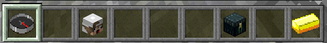
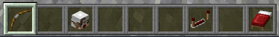

# ❔ Comment jouer ?

**I.** Pour jouer, c'est très simple ! Il vous suffit de vous connecter au serveur avec l'IP `MC.MISTIVIA.FR`.


Si vous êtes un joueur cracké et que vous n'arrivez pas à vous connecter, regarder la page [Connexion](../../fonctionnalites/connexion.md) pour une aide.


**II.** Lorsque vous êtes **connecté**, utilisez votre **Boussole** et cliquez sur **l'Arc** situé dans le menu.

**III.** Ensuite, vous serez envoyé sur le **serveur de jeu**.

**IV.** Il vous suffira finalement de cliquez sur **l'Arc** de votre inventaire, de **choisir une map** et de **vous amuser** !

